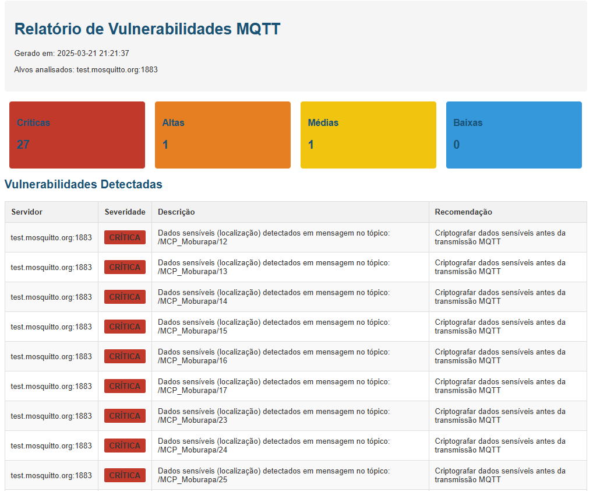

# MQTT Security Explorer

<div align="center">
  
  
  
</div>

## 🔒 Visão Geral

MQTT Security Explorer é uma ferramenta avançada de análise de segurança para brokers MQTT, amplamente utilizados em ecossistemas IoT e comunicações M2M. Esta ferramenta foi projetada para profissionais de segurança e administradores de sistemas realizarem avaliações de segurança em ambientes MQTT.

<div align="center">
  
</div>
## ✨ Características

- **Detecção de vulnerabilidades comuns:**
  - Conexões anônimas (sem autenticação)
  - Credenciais fracas ou padrão
  - Acesso a tópicos sensíveis do sistema
  - Dados sensíveis transmitidos sem criptografia

- **Análise inteligente:**
  - Brute force inteligente (sem tentar senhas se a conexão anônima for bem-sucedida)
  - Suporte a múltiplos formatos de URL (mqtt://, mqtts://, tcp://, ssl://)
  - Configuração via arquivos .env para customização simplificada

- **Manipulação e modificação de mensagens:**
  - Interceptação de mensagens em tempo real
  - Modificação automática de campos JSON
  - Injeção de mensagens personalizadas
  - Republicação de mensagens modificadas

- **Relatórios detalhados:**
  - Geração de relatórios HTML visualmente atrativos
  - Classificação de vulnerabilidades por severidade
  - Recomendações específicas para cada vulnerabilidade
  - Exportação de resultados completos em formato JSON

## 🛠️ Instalação

```bash
# Clonar o repositório
git clone https://github.com/seu-usuario/mqtt-security-explorer.git
cd mqtt-security-explorer

# Instalar dependências
pip install -r requirements.txt
```

## 📋 Requisitos

- Python 3.6+
- Paho MQTT Client
- python-dotenv
- Acesso de rede aos brokers MQTT alvo

## 🚀 Uso

### Interface de linha de comando:

```bash
# Explorar um único broker MQTT
python mqtt_explorer.py --url mqtt://exemplo.com:1883

# Explorar a partir de uma lista de URLs
python mqtt_explorer.py --url-file mqtt_urls.txt

# Explorar com parâmetros específicos
python mqtt_explorer.py --host exemplo.com --port 1883 --ssl

# Modo de modificação de mensagens
python mqtt_explorer.py --url mqtt://exemplo.com:1883 --modify --topic "#"

# Injetar uma mensagem específica em um tópico
python mqtt_explorer.py --url mqtt://exemplo.com:1883 --modify --topic "test/topic" --inject "{\"message\":\"Hello World\"}"

# Modificar um campo específico em mensagens interceptadas
python mqtt_explorer.py --url mqtt://exemplo.com:1883 --modify --field "temperature" --value "25.0"

# Multiplicar valores numéricos em mensagens JSON
python mqtt_explorer.py --url mqtt://exemplo.com:1883 --modify --field "speed" --multiply 1.5
```

### Interface de script shell:

```bash
# Execução com menu interativo
./mqtt.sh
```

### Personalização:

Edite o arquivo `.env` para personalizar:
- Listas de usernames e passwords para brute force
- Número máximo de threads
- Tempos de timeout e espera
- Configurações de relatório

### Módulo de modificação MQTT:

A ferramenta inclui o módulo `mqtt_modifier.py` que pode ser usado também como uma biblioteca independente:

```python
from mqtt_modifier import MQTTModifier, json_field_modifier

# Criar um modificador
modifier = MQTTModifier("broker.exemplo.com", 1883)
modifier.connect()

# Modificar campo "status" para "offline" em todas as mensagens JSON
modifier.start_interception(
    topic_filters=["devices/#"],
    modifier_func=json_field_modifier("status", "offline"),
    republish=True
)
```

## 📊 Exemplo de Relatório

As vulnerabilidades são apresentadas em um relatório HTML intuitivo:

- **Severidade crítica:** Dados sensíveis expostos
- **Severidade alta:** Conexões sem autenticação, credenciais fracas
- **Severidade média:** Acesso a tópicos sensíveis
- **Severidade baixa:** Configurações não ideais

## 🔍 Boas Práticas de Segurança MQTT

Ao utilizar esta ferramenta, considere as seguintes recomendações:

1. **Autenticação e Autorização:**
   - Sempre exija autenticação de clientes
   - Use senhas fortes e únicas para cada cliente
   - Implemente ACLs (Listas de Controle de Acesso)

2. **Criptografia:**
   - Utilize TLS (SSL) para todas as conexões MQTT
   - Configure corretamente o nível de segurança TLS

3. **Gerenciamento de tópicos:**
   - Use hierarquia de tópicos bem estruturada
   - Limite acesso a tópicos do sistema ($SYS/#)

4. **Segurança de dados:**
   - Não transmita credenciais ou tokens em tópicos MQTT
   - Criptografe dados sensíveis antes da publicação
   - Implemente validação de mensagens para prevenir injeção de dados maliciosos
   - Considere a integridade das mensagens utilizando assinaturas digitais

## ⚠️ Aviso Legal

Esta ferramenta deve ser usada apenas para fins legítimos de segurança e teste. Obtenha sempre autorização por escrito antes de realizar testes em sistemas que não são de sua propriedade. O uso desta ferramenta para atividades não autorizadas pode violar leis locais, estaduais e federais.

## 🤝 Contribuições

Contribuições são bem-vindas! Por favor, sinta-se à vontade para enviar pull requests, relatar bugs ou sugerir recursos.

## 📜 Licença

Este projeto está licenciado sob a licença MIT. Veja o arquivo LICENSE para mais detalhes.

## 📧 Contato

Para qualquer dúvida ou sugestão, entre em contato:
- LinkedIn: [Steven Guimaráes](https://www.linkedin.com/in/steven-guimaraes-29aa79212/)


## 📖 Modos de Operação

### Modo de Análise
O modo principal da ferramenta, focado em descobrir vulnerabilidades em brokers MQTT.

### Modo de Modificação
Permite interceptar e modificar mensagens em tempo real, útil para:
- Testar a robustez de aplicações contra dados maliciosos
- Simular falhas ou comportamentos específicos
- Realizar testes de penetração avançados
- Analisar o impacto de modificações em sistemas IOT

---

<div align="center">
  <sub>Desenvolvido com ❤️ por Seu Nome</sub>
</div>
